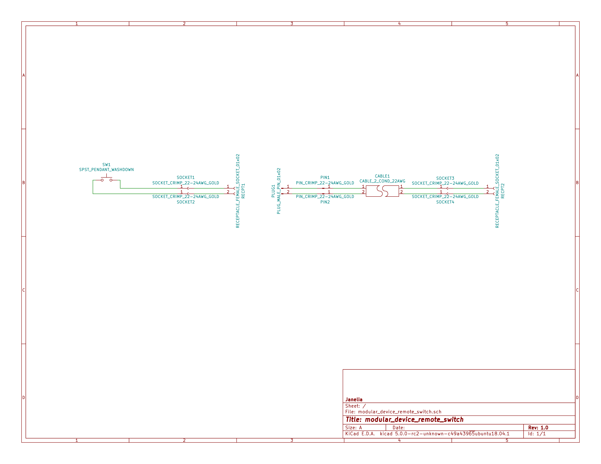

- [Repository Information](#orgf622dc0)
  - [Description](#org86312a0)
- [Images](#org7bb9abf)
- [Schematic](#orgae2ca24)
- [Bill of Materials](#orga05eb87)
  - [PCB Parts](#org3329ddc)
  - [Supplemental Parts](#orgb188917)
  - [Vendor Parts Lists](#orgbf241f8)
- [Supplemental Documentation](#org10c553b)
  - [Assembly Instructions](#orge26d312)

# Repository Information

-   **Name:** modular\_device\_remote\_switch
-   **Version:** 1.0
-   **License:** Open-Source Hardware
-   **URL:** <https://github.com/janelia-kicad/modular_device_remote_switch>
-   **Author:** Peter Polidoro
-   **Email:** peterpolidoro@gmail.com

## Description

This switch connects to modular devices to allow remote button presses.

# Images

# Schematic

[./schematic/modular\_device\_remote\_switch.pdf](./schematic/modular_device_remote_switch.pdf)

# Bill of Materials

## PCB Parts

| Item | Reference(s)                    | Quantity | PartNumber  | Vendor   | Description                         |
|---- |------------------------------- |-------- |----------- |-------- |----------------------------------- |
| 1    | CABLE1                          | 1        | A120-100-ND | digikey  | MULTI-PAIR 2COND 22AWG 100FT        |
| 2    | PIN1 PIN2                       | 2        | WM2515-ND   | digikey  | CONN TERM MALE 22-24AWG GOLD        |
| 3    | PLUG1                           | 1        | WM2533-ND   | digikey  | CONN HOUSING MALE 2POS .100         |
| 4    | RECPT1 RECPT2                   | 2        | WM2800-ND   | digikey  | CONN HOUSING 2POS .100 SINGLE       |
| 5    | SOCKET1 SOCKET2 SOCKET3 SOCKET4 | 4        | WM2512-ND   | digikey  | CONN TERM FEMALE 22-24AWG GOLD      |
| 6    | SW1                             | 1        | 6944K11     | mcmaster | Pendant Switch Washdown Push Button |

## Supplemental Parts

| Item | Quantity | PartNumber    | Vendor  | Description                              |
|---- |-------- |------------- |------- |---------------------------------------- |
| 1    | 1        | VFP014-1R0-ND | digikey | HEATSHRK VFP876 0.25 inch X 1 inch 50PCS |
| 2    | 1        | 1030-1001-ND  | digikey | SLEEVING 0.125 inch X 225 feet BLACK     |
| 3    | 1        | 1030-1333-ND  | digikey | SLEEVING 0.125 inch X 225 feet RED       |
| 4    | 1        | 1030-1332-ND  | digikey | SLEEVING 0.125 inch X 225 feet PURPLE    |
| 5    | 1        | 1030-1331-ND  | digikey | SLEEVING 0.125 inch X 225 feet GREEN     |
| 6    | 1        | 1030-1334-ND  | digikey | SLEEVING 0.125 inch X 225 feet YELLOW    |

## Vendor Parts Lists

[./bom/digikey\_parts.csv](./bom/digikey_parts.csv)

[./bom/mcmaster\_parts.csv](./bom/mcmaster_parts.csv)

[./bom/supplemental\_digikey\_parts.csv](./bom/supplemental_digikey_parts.csv)

# Supplemental Documentation

## Assembly Instructions

-   Choose 0.125 inch expandable sleeving color and cut to 18 inches.
-   Expand sleeving and slip over the two pendant switch wires, pushing it over the wires until the sleeve is within 0.5 inches from the switch.
-   Slip one 0.25 inch x 1 inch heat shrink tube over the wires and expanded sleeveing and push it as close to the switch as possible so it is covering one fraying end of the sleeving.
-   Slip another 0.25 inch x 1 inch heat shrink tube over the wires and expanded sleeving and push it until the center of the heat shrink tube is about 1.5 inches from the ends of the switch wires so it is covering the second fraying end of the sleeving.
-   Use a heat gun to shrink both heat shrink tubes on the sleeving and switch wires.
-   Use wire cutter to trim the two switch wires to the same length.
-   Use wire stripper to remove 0.1 inches of insulation from each of the two switch wires.
-   Use crimp tool to crimp one socket onto the end of each switch wire, using a total of two sockets.
-   Insert each of the two sockets into one receptacle connector, either wire can be placed into the pin 1 position, the placement position is not imporant.
-   Cut the 2-conductor cable to the desired length and remove 2 inches of the cable jacket from each of the two ends of the cable.
-   Slip a 0.25 inch x 1 inch heat shrink tube over each end of the cable jacket and use a heat gun to shrink it into place.
-   Use wire cutter to trim the two cable wires to the same length on each side of the cable.
-   Use wire stripper to remove 0.1 inches of insulation from each end of the two wires in the cable.
-   One one end of the cable, use crimp tool to crimp one socket onto the end of each the two cable wires, using a total of two sockets.
-   Insert each of the two sockets into one receptacle connector, either wire can be placed into the pin 1 position, the placement position is not imporant.
-   One the other end of the cable, use crimp tool to crimp one pin onto the end of each the two cable wires, using a total of two pins.
-   Insert each of the two pins into one plug connector, either wire can be placed into the pin 1 position, the placement position is not imporant.
-   Insert the receptacle connector attached to the switch into the plug connector on the cable.
-   Insert the receptacle connector attached to the cable into a two-pin BTN connector on the modular device.
